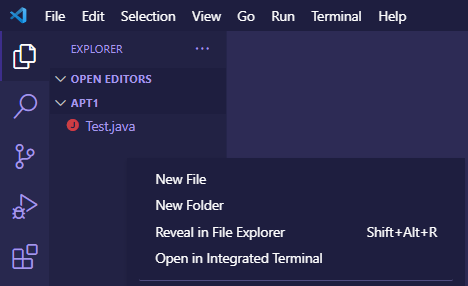
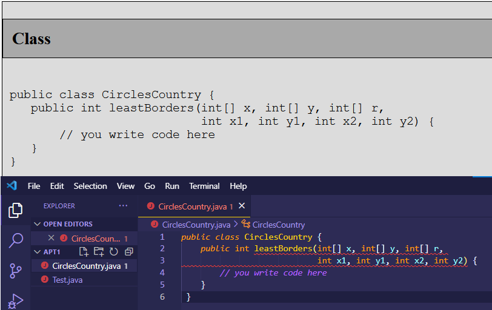

# APT Workflow
APTs are small-scale “problem sets” where you have to write a Java method to solve a particular problem. Unlike assignments (projects), APTs do not come with starter codes for you to clone and import. Instead, for each APT problem, you will create your own Java file (using an empty method stub as a starting point) and upload that to a testing server. This guide goes over best practices for organizing APT code.

In particular, as mentioned in the installation guide, we recommend creating a single directory where you will store subdirectories containing each APT set, as shown below:

```
▼ CS 201
  ▼ APT
    ▼ APT 1
      - AccessLevel.java
      - CirclesCountry.java
    ▼ APT 2
      - TxMsg.java
      - ...
  ▼ Projects
    ▶ P0-Person201
    ▶ P1-NBody
    - ...
```

## Creating a New Folder for each APT set

Unlike other IDEs, VS Code stores code in folders, not projects. Under the APT directory, go ahead and create a new folder/subdirectory for each APT set, e.g. “APT1” containing code for the first APT set. Proceed to open this folder (e.g APT1) in VS Code. 

## Creating New Java Classes
You can create a new Java class (file) in this folder.

Right clicking on the directory, choose “New File”:

<div align="middle">
  
</div>

When creating Java classes for APTs, the APT problem statement should have provided you a name for the class as well as some stub code for you to get started, as shown below. _**Type the same class name in the “New Java Class” window and copy in the stub code into the file.**_

<div align="middle">
  
</div>

Now you can start developing your code. (If you get a red error like shown above, don’t worry. You should be able to resolve the error once you put in a `return` statement.)

## Running your code
You can only run a Java class if it has a `main` method (more on that later in the course). For assignments, we will most likely provide a class with a `main` method for you. For APTs, you typically do not need to execute any files you create (but you can still create a `main` method to debug your APT). 

To run a Java class, either right-click the file and click `Run Java` or click the triangle in the upper right.

<div align="middle">
  
</div>

## REMAINING THINGS HERE: 
FILL IN REST: https://docs.google.com/document/d/1dlEwDwiIyEQFxXOHS_zY-Qojx4djl4p2Ud16qpeb7gY/edit#

Note to Matthew, the following students (especially Git repo) are not as important.

## (Optional) Creating a main method for APTs
As mentioned above, you do NOT need to run your code for APTs; as such, a main method is not required. Nevertheless, if you’re having errors, having a main method is extremely helpful for debugging your code.

To create a main method, add the following method within the class (it should not be nested within another method):

```
public static void main(String[] args) {
    // code here
}
```

And then replace // code here with code that you want to execute.

For APTs, you typically want to run the method you wrote on some specific inputs. Thus, your main method will mainly consist of the following steps:
Declaring input variables (parameters of the APT method) and initializing them with values
Creating a new object of the APT class by using new APTNameHere()
Calling the method and storing the return value in a variable
Print out the return value using System.out.println()

As a concrete example, here’s a Java class for the the Starter APT with a main method for debugging:
public class Starter {
public int begins(String[] words, String first) {
// replace this code 
return 0;
}
public static void main(String[] args) {
    String[] words = {"easy", "lies", "the", "head", "that", "wears", "yellow"};
    String first = “e”;
    Starter obj = new Starter();
int ans = obj.begins(words, first);
System.out.println(ans);
}
}

Note that if the return value is an array, you can use Arrays.toString to print out the contents of the array:

    // a is an array
    System.out.println(Arrays.toString(a));

Remember you can use a main method to test you code, but it must be removed or commented out before you submit it to the APT tester.

(Optional) Creating a Git Repo for APTs
Using Git for APTs is not required, but we recommend that you create a Git repo for APTs and push your work to GitLab regularly. This helps preserve your work in a catastrophic computer failure.
Creating a Git repo without an existing IntelliJ project
The following steps are for starting afresh on the APT, when you don’t have any files on your computer. This is the recommended workflow: create a repository on GitLab first, clone the empty repo to your computer, then create an IntelliJ project there.

Create a new repository in GitLab: https://coursework.cs.duke.edu/projects/new
Remember to make your repository private!!!
Open a Terminal or CMD/Git Bash shell, and use the cd command to navigate to where you want to save the project, typically your CS201 workspace.
Once you’re in the directory, type

    git clone <your-project-URI>

Replacing <your-project-URI> with the SSH URI of your GitLab project (obtained from the “Clone” option on your project’s home page).
The git clone command should have created a new directory in your CS201 workspace for the Git repo. Create a new IntelliJ project in this directory.

When you make changes (e.g. made progress on a few APT problems), remember to push them to Git regularly using the standard command sequence mentioned above.

Creating a Git repo with an existing IntelliJ project on the local machine
This section is for the case where you already have some work done on your computer, but now want to create a GitLab repository and upload your work there.

Create a new repository in GitLab: https://coursework.cs.duke.edu/projects/new
Remember to make your repository private!!!
Open a Terminal or CMD/Git Bash shell, and use the cd command to navigate to your directory. This should be the project directory, not the general CS201 workspace. 
Make sure you’re in the root folder of your project: it should contain a src subdirectory which has all the Java files.
Once you’re in the directory, use the following commands:

`git init
git remote add origin <your-project-URI>
git add .
git commit -m "Initial commit"
git push -u origin master`

Replacing <your-project-URI> with the SSH URI of your GitLab project (obtained from the “Clone” option on your project’s home page). These commands will initialize the directory as a Git repository and link it to the remote repo.
Note the “-u origin master” arguments for git push. These are necessary in this particular scenario, as they tell Git which remote repository and branch to push to.

You should now be able to see contents of the repository on GitLab. When you make additional changes, you can use use the standard command sequence for pushing, without the “-u origin master” part.
