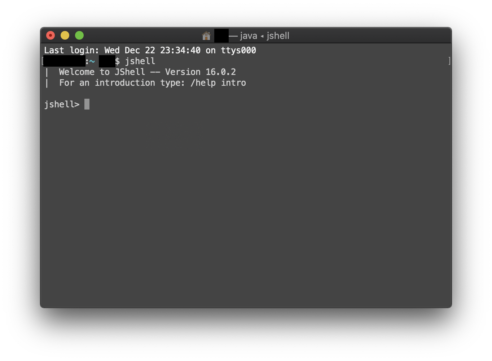
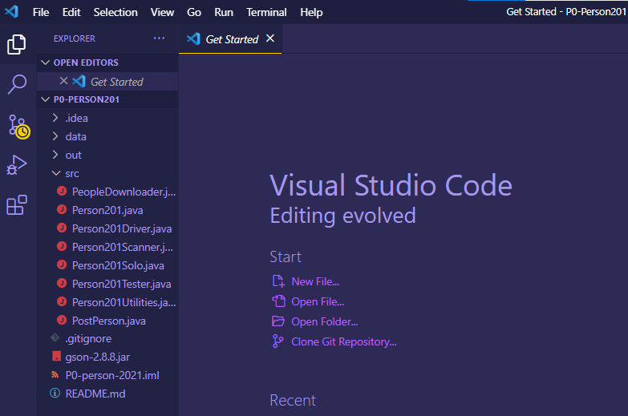
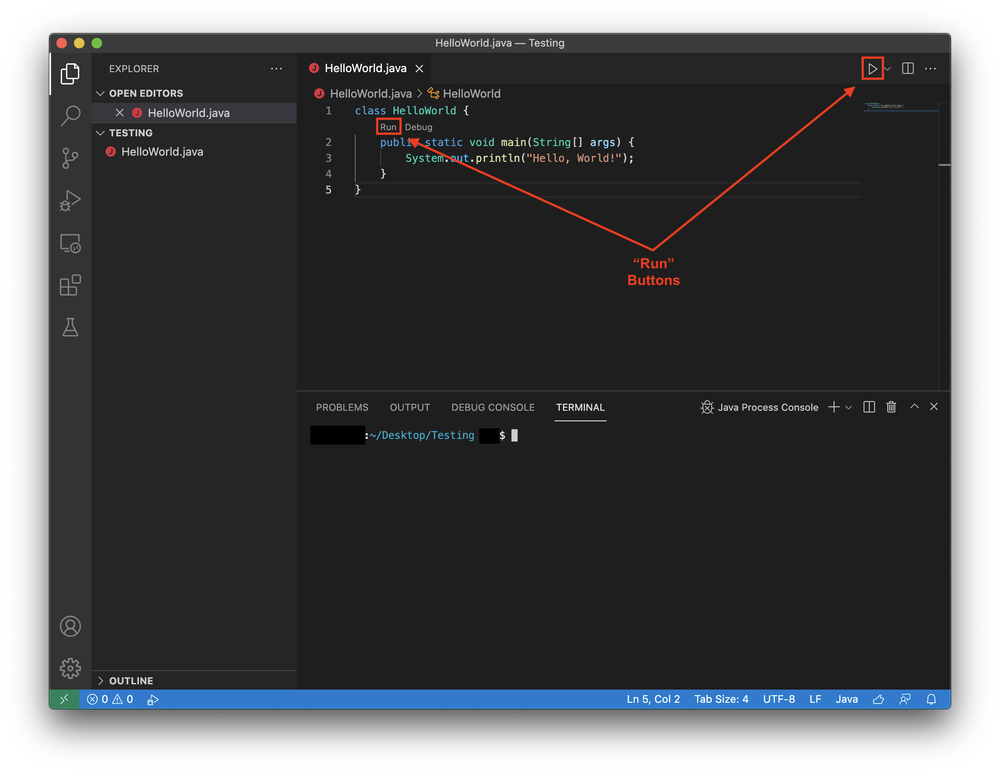

# Installing Software for CompSci 201

You will need Java, VS Code, and Git to complete work in Compsci 201. Installation of these is described below. The software runs on Mac and Windows machines.

## Installing Java and JShell

At Duke we’re using the Liberica JDK developed by Bellsoft, based on the open-source OpenJDK. You may have other versions and/or sources of JDK on your local machine if you installed other programs, ***but you should use the latest version of Liberica JDK for CompSci 201***. The current version is JDK 15 as of January 2021 (some images may be for previous versions).

The screenshots in this document are for Windows and the installer for Mac is different, but once you've selected the installer the instructions here should work for you.

The steps below will install both Java and JShell on your computer, since JShell is now built-in with Java.

### Download the JDK

Go to https://bell-sw.com/ and click on “Current release”, as shown on the right. You will be directed to the download page.

Choose the version of the installer for your OS: You should download the **PKG file for Mac**, and **MSI file for Windows**, as shown below. If you have **Apple Silicon/M1** or a **Surface Pro X**, be sure to change your version from x86 to **ARM**.

<div align="middle">
  
   
</div>

### Installing the JDK

Run the file you downloaded and you should see a setup wizard. Follow the steps and if you get a prompt asking for permissions, accept it.

***We recommend not changing the installation path***. On Windows, that means you will be installing Java in a directory starting with `C:\Program Files\`. In this way, if you have any issues with Java or VS Code later in the course, the UTAs can identify issues more easily.

<div align="middle">
  
</div>

### Launching JShell

JShell is an interactive tool that allows you to write and execute Java statements on the command line. You can declare variables, execute Java statements and view the values of variables in real time, without having to create a class or a main method.

***You do not necessarily need to use JShell for the purpose of CompSci 201, but you’re recommended to***. JShell is very helpful if you have conceptual questions about Java and want to verify them using simple examples: for instance, if you’re not sure how the `HashSet.retainAll()` method behaves, you can open JShell, create two `HashSet` objects with some values, make a call to `retainAll()` and observe the new values of the two sets.

While you don’t need to know how to use JShell right now, ***we recommend running it at least once to verify it is working as intended***. Once you have Java installed, you should be able to use JShell immediately:

1. Open a Terminal on Mac or Command Prompt on Windows.

2. Type `jshell` and press Enter.
If the Java installation worked properly, you should see a welcoming message, and then you should be able to type Java expressions:

If you encounter an error (e.g. “Command not found”), it probably means the Java installation path was not added to the system’s PATH variable. Follow [this guide](https://community.akamai.com/customers/s/article/Adding-JDK-Path-in-Mac-OS-X-Linux-or-Windows?language=en_US) to add it to PATH.

<div align="middle">
  
</div>

***While JShell allows you to use basic Java functionality and expressions, it is not what we use for coursework in CompSci 201. Most of the coding will be done in VS Code, as described below.***

You can type `/exit` to quit jshell in your terminal.

## Installing Visual Studio Code

At Duke we will use Visual Studio Code as the official development environment (IDE) for CompSci 201. In the past we have used Eclipse and IntelliJ, but we are switching to VS Code in Spring 2022. This portion of the guide was made possible with support from Raj Kundu (T'22).

### Download Visual Studio Code

You can download the latest version of Visual Studio Code at https://code.visualstudio.com/. The download instructions should be on the front page of the website. This should download a .exe file for Windows or a .zip file for Mac - follow the instructions given for [Windows](https://code.visualstudio.com/docs/setup/windows) or [Mac](https://code.visualstudio.com/docs/setup/mac).

### Launch and Configure Visual Studio Code
After installation, you should be able to run Visual Studio Code and if so, you'll be greeted with a screen like the following. If you wish, you can further customize the screen (like the author has!) by going to File -> Preferences -> Settings.

<div align="middle">
  
</div>

In CompSci 201, you will mainly use “Open Folder” for assignments (large-scale Java projects) and create your own folder for APTs. Once you have worked on some projects with VS Code, a list of recently opened projects can be found under "Open Recent."

### Install VS Code Extensions for Java

1. Open the “Extensions” Pane of the Sidebar
2. Search for “CS201”
3. Click the blue “Install” button to install the “Duke CS201 Java Extension Pack” extension

<div align="middle">
  
</div>

### Organizing Your Code

Unlike some other IDEs, VS Code works with folders, not "VS Code projects" - so any folder/directory that exists on your computer can be opened in VS Code with `File > Open`.

In CS 201, use any file structure which makes sense to you. The following is an example of a file structure which you might use, for example:

```
▼ CS 201
  ▼ APT
    ▼ 1
      - AccessLevel.java
      - CirclesCountry.java
    ▼ 2
      - TxMsg.java
      - ...
  ▼ Projects
    ▶ P0-Person201
    ▶ P1-NBody
    - ...
```

### Testing VS Code + Java

While you don’t have to write any code for now, we highly recommend creating a first project to ensure that VS Code works properly with the Java JDK:

1. Create a temporary folder to house this project anywhere you would like
    - For example, if you were using the file structure above, you might create a temporary folder under the `CS 201` folder called `Testing`
    - A temporary foler in your Desktop or Documents folder works as well!
2. Open VS Code, click `File > Open`, and navigate to the folder you just created.
3. Create a new file using `File > New File`. Save it (`File > Save`) as `HelloWorld.java`.
4. Paste the following code into `HelloWorld.java`:
    ```java
    public class HelloWorld {
      public static void main(String[] args) {
        System.out.println("Hello, world!"); 
      }
    }
    ```
5. Save `HelloWorld.java` and run it using either of the "Run" buttons highlighted below.
<div align="middle">
  
</div>

6. You should see the integrated terminal window pop up, and your program should run and print `Hello, world!` into the terminal.

For a quick introduction to VS Code, you can skim [these](https://code.visualstudio.com/docs/introvideos/basics) official introductory resources. If you choose to do this, just watching the first one or two videos (<10 min.) should be more than enough!

## Installing Git and Configuring GitLab

Git is the most widely used version control system. Git allows you to keep track of the history of your projects and sync them with a remote copy on the Internet. We use Git in CompSci 201 and in many other courses at Duke. We use GitLab at https://coursework.cs.duke.edu as the online Git platform for you to get the starter code and upload your work. You'll authenticate using your NetID.

## Installing Git

**TLDR**: You can watch our UTAs go over the following Git installation process using Windows and Mac [here](https://drive.google.com/drive/u/0/folders/1SxcqxJKTsvZ-e8KXciQ6m5TULlY7-9tO) under the videos "Mac_SSH_Key" and "Windows_SSH_Key."

Head to https://git-scm.com/downloads and download the version of Git for your platform: Mac, Windows, Linux. Install this on your machine. Use default settings when prompted.

**Note**: On Mac you might see several options for downloading and installing Git. Any of them works, though we recommend using ***Homebrew***. To install Homebrew, run the following command in Terminal:

`/bin/bash -c "$(curl -fsSL https://raw.githubusercontent.com/Homebrew/install/HEAD/install.sh)"`

After you’ve installed Homebrew, run the command `brew install git`.

### Setting Up Credentials in Git

Git can be used either on the command line (like Terminal in Mac and CMD on Windows), via the Git GUI, or via VS Code's built-in Git integration. **However, we strongly recommend that you use Git on the command line**. 

On a Mac, use the Terminal application, on Windows use either the Command Prompt that comes with the OS or the Git Bash Shell that is part of the Windows Git install.

In this shell/terminal type the commands below, but use your name and the ***firstname.lastname@duke.edu*** email address (with MI if applicable).

```bash
git config --global user.name "Owen Astrachan"
git config --global user.email "owen.astrachan@duke.edu"
```

### Generating SSH Key 

SSH is the protocol that Git uses to communicate to the remote server (GitLab in this case). You need to create an SSH key on your local machine, and then configure it in your settings on GitLab.

Refer to this documentation by GitLab on how to create an SSH key, specifically, the “***Generating a new SSH key pair***” section. Please use the **ED25519** command: https://coursework.cs.duke.edu/help/ssh/index.md

Again, you should use the ***firstname.lastname@duke.edu email address as your comment for your email***. Afterwards, when prompted to “Enter file in which to save the key” and “Enter passphrase”, ***we recommend saving the key at the default location and setting no passphrase (by just pressing Enter twice)***.
Note that for this step, Git Bash must be used on Windows. (The Command Prompt is still sufficient for other uses of Git.)

### Adding SSH Key to GitLab

Follow the stops in the next section in the GitLab documentation, “***Adding an SSH key to your GitLab account***”:
https://coursework.cs.duke.edu/help/ssh/index.md

Note that you will use the commands shown in the documentation (subject to your OS) to copy the ***public*** part of your SSH key, ***which should start with “ssh-ed25519”***. You will then login to your GitLab account at https://coursework.cs.duke.edu, enter “Settings” from the top right corner, and then paste the public key by following the instructions in the documentation.

**NOTE**: You must use https://coursework.cs.duke.edu and log in via Shibboleth if you want this process to work. To know that this worked, your GitLab username will be @firstname.lastname, not @netID

To verify that everything has been set up perfectly, use the following command:

`ssh -T git@coursework.cs.duke.edu`

If you see a welcoming message with your name, you’re done! Enjoy!

Note that if you see this prompt instead:
<div align="middle">
  
</div>
Then that means that your computer doesn't recognize coursework.cs.duke.edu yet. Just reply yes to the prompt and then it should continue connecting.


