# Project Workflow
This guide will walk you through how to complete Java assignments/projects in Compsci 201 by using P0: Person201 as an example. Before starting, you should have installed all the necessary software (Java Liberica JDK, Git Bash, Visual Studio Code) as explained in this guide. You should have also installed a personal SSH key, as explained in the previous version of this guide.

TODO DANIEL: ADD IN LINK ABOVE.

**NOTE**: If you wish, you may also follow these instructions in [video format.](#tutorial-videos)

## Overview of Visual Studio Code

The official introduction to VS Code can be found [here](https://code.visualstudio.com/docs). In particular, the following links should be useful in getting to know VS Code!
- [User Interface](https://code.visualstudio.com/docs/getstarted/userinterface)
- [Settings](https://code.visualstudio.com/docs/getstarted/settings)
- [Introductory Videos](https://code.visualstudio.com/docs/getstarted/introvideos)

Upon installing VS Code, you'll be greeted with a launch screen like this:

<div align="middle">
  
</div>

For this course, you'll mainly be using "Open" to open folders that each store a collection of related Java files that you will code, run, and test.

## Step 0: Creating a Workspace for the Course

These instructions are copied over from the installation guide. For CS 201, you should set up a folder to store your code related to this course. It should be

in a location that you will remember
in a format/structure that makes sense to you

We recommend the following folder setup:

```
▼ CS 201
  ▼ APT
    ▼ APT 1
      - AccessLevel.java
      - CirclesCountry.java
    ▼ APT 2
      - TxMsg.java
      - ...
  ▼ Projects
    ▶ P0-Person201
    ▶ P1-NBody
    - ...
```

For this guide, we'll be focusing on the second subfolder, `Projects`.

## Step 1: Forking the Starter Code

For every Java project (sometimes called “assignment”), course staff will create a starter code repository on GitLab with namespace `201<semester><year>`, e.g. `201fall20`. The instructions document for the assignment will provide a link to the source code, which you should open.

Once you open that GitLab repository, **_you will need to fork the project first_**, that is, create your own copy of the repo. Click on the **“Fork”** button at the top right: (_If you don’t see the “Fork” button, sign in with your Duke NetID from the top right_).

<div align="middle">
  
</div>

Then choose your own account to fork it under your namespace (example: Charles Lyu (T'21)):

<div align="middle">
  
</div>

Once you fork the project, you should see your own name in the URL and on the project home page. It should also mention that your project is forked from the 201 namespace.

<div align="middle">
  
</div>

# Cloning the Repository to Your Computer

**_Now we need to clone your fork of the project using Git_**, that is, create a copy of the repo on your local machine.

Click on the **"Clone"** button, then copy the **_SSH URI link._** _DO NOT USE HTTPS!_

<div align="middle">
  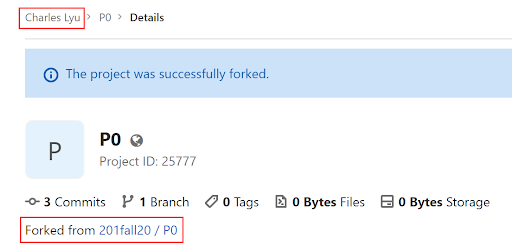
</div>

Now, open a _Terminal_ on Mac, or open either the _Command Prompt_ or _Git Bash_ shell on Windows (Command Prompt is more convenient as it allows Ctrl+V to paste). You will need to navigate to the place where you want to save the project, typically your CS201 workspace, using the cd command. Type

`cd "folder name"`

(use the actual folder name, and keep the quotation marks if it contains spaces) and press Enter. Keep doing this until you’ve reached the destination. On Mac you can type pwd to show the current directory and verify you’re at the correct place.

Once you’re in the directory of your choosing, type

`git clone your-project-URI`

where `your-project-URI` is the SSH URI you copied. Use Command-V/Ctrl-V to paste (or, in a Git Bash, right click and choose “Paste”).

Make sure the SSH URI is for the forked repo, i.e. has your own name in it! If it still has the 201 namespace, then fork the project [as described above](#step-1-forking-the-starter-code).

<div align="middle">
  
</div>

Git should have now created a new directory `“p0-person”`  within the current directory, with all files from the remote repo stored in it. Once you finish cloning, typing `ls` in Terminal/Git Bash or `dir` in Command Prompt should show the new directory with the project name. Alternatively, you can verify the existence of the project directory in the Finder or File Explorer.

If you encounter any errors or do not see the new directory, refer to the [Troubleshooting Document](https://docs.google.com/document/d/1Ce7HFLmEGsRMwGXGIxt5TpLHmjmjafHn1jNf7MRO8qw/edit).

TODO DANIEL: REPLACE WITH MARKDOWN

## Alternative Method: via VS Code

Alternatively, you can clone the repository directly through VS Code. Click the `Visual Studio Code (SSH)` button.

<div align="middle">
  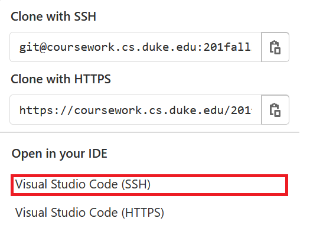
</div>

Accept all prompts. It will redirect you to Select a Repository Location, i.e, select the folder in which you will store the project. We recommend storing this folder in the same folder you've designated to store your projects.

<div align="middle">
  
</div>

Once you've done this, proceed to open your project.

# Step 3: Open the Project in VS Code

From VS Code, choose "Open Folder" from the welcome screen, and navigate to the project folder.

<div align="middle">
  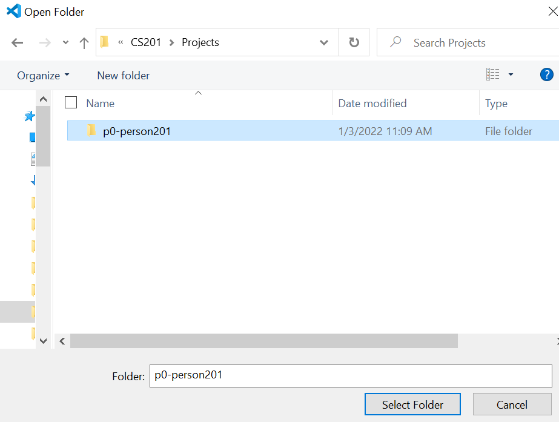
</div>

You should now have access to the contents of the folder!

# Step 4: Working on the Assignment

The assignment writeup document will tell you what you have to do. Most of the work will be completing existing Java classes given in the starter code, but sometimes you will also have to create your own classes/Java files. 

Many assignments come with executable classes, typically named as “Driver” or “Benchmark”, that you can run to test the correctness of your code or generate results for analysis questions. Refer to the “Running your code” section on how to execute them.

TODO DANIE: LINK TO RUNNING YOUR CODE

# Step 5: Pushing your Code to Git

“Pushing to Git” means saving your changes as a Git commit and uploading them to the GitLab repo, so that your changes are now reflected in the online server.

***You should push your code regularly while working on the project*** (as a way to backup your code in case of technical issues). ***You have to ALWAYS push your code to Git EVERY TIME BEFORE submitting or resubmitting the project on Gradescope*** (otherwise your changes won’t appear on Gradescope and will NOT be graded).

First, open a Terminal or CMD/Git Bash shell, and use the cd command to navigate to your project directory. Note that you have to enter ***the directory for this specific project*** (e.g. “p0-person”), not your general “CS201” workspace. Also, do not go inside the `src` folder.

Once you’re in the project directory, use the following 3 commands:

```bash
git add .
git commit -m "a short description of your commit here"
git push
```

Replace `“a short description of your commit here”` with an actual, meaningful commit message, e.g. “Finished the Person class” or “Passed all JUnit tests”. ***Double quotation marks are necessary.*** Also, note the period (.) after the `git add` command.

If the push is successful, you should see a message similar to below. If you’re encountering errors, refer to the Troubleshooting Document.

<div align="middle">
  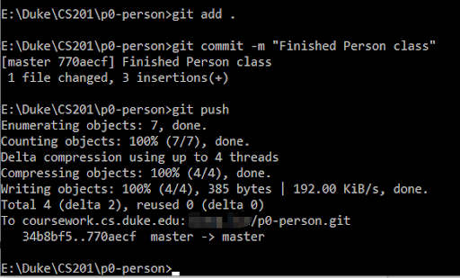
</div>

***Remember to always use the 3 commands together every time you push! Don’t leave out any of them.***

It’s helpful to open your repository from GitLab (http://coursework.cs.duke.edu) to verify that all changes have been reflected.

***Alternatively***, you can use VSCode's Source Control feature to push changes without using the command line. To do so, first click the "Source Control" tab on the left side of the IDE and stage the changes by clicking the "+" icon next to the "Changes" heading. 

<div align="middle">
  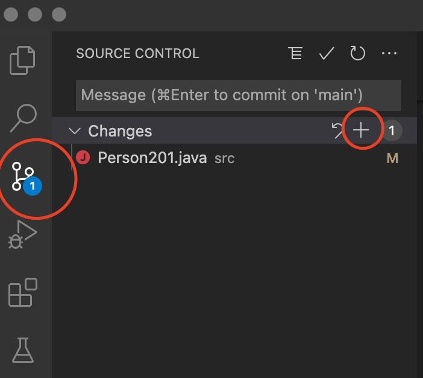
</div>

Next, click the checkmark to commit changes; you'll also need to add a commit message here.

<div align="middle">
  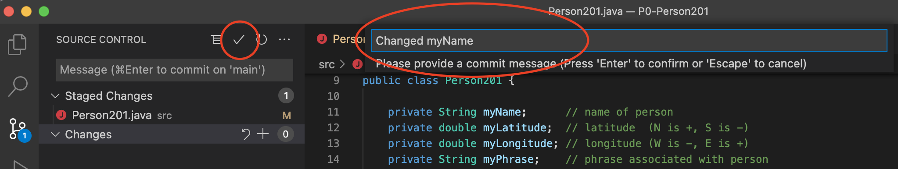
</div>

Finally, push your changes by selecting "Sync Changes".

<div align="middle">
  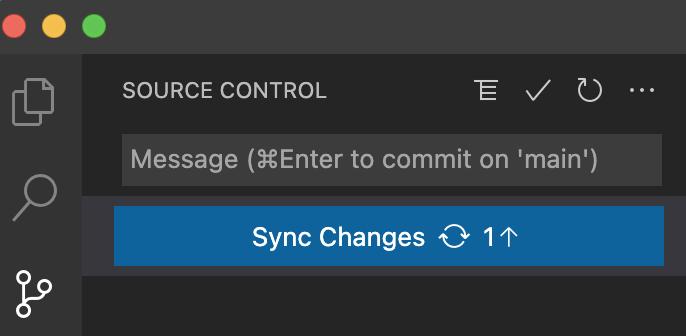
</div>

# Step 6: Submitting your Project on Gradescope

Once you’ve completed the programming part of the project and passed all/most of the tests that come with the starter code, you can submit your work to Gradescope. ***You will need to submit or resubmit your project to Gradescope every time you make a change in any of the files in your Git repo.***

Before you submit, ***make sure you have pushed all your changes to Git.*** Open your repo in GitLab to verify the changes have been pushed.

Login to Gradescope using “***School Credentials***” so that you can login using your NetID. After you login to Gradescope, you should see the course in the dashboard:

<div align="middle">
  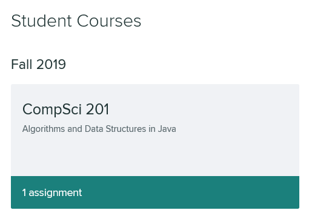
</div>


Once you open the course, you can see a list of assignments, their due dates and your submission status. Clicking on the assignment title will bring you to a submission page:

<div align="middle">
  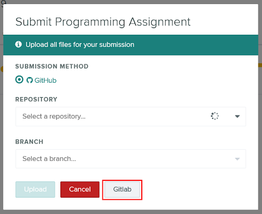
</div>

Choose “***GitLab***” for submission. Do NOT use GitHub!!!

You will then be prompted to choose a repository to submit. Note that due to a bug with GitLab, ***the “Last Updated” times could be inaccurate***, but your latest changes will always be submitted.

<div align="middle">
  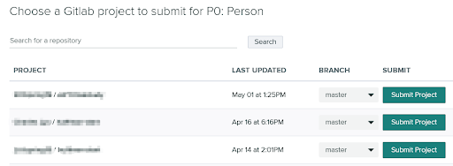
</div>

Once you upload the submission, it will lead you to a page with the autograder results. Most of the time you will see the following message. Wait patiently: the autograder might take up to 5~10 minutes to run depending on the efficiency of your code, especially for later assignments.

<div align="middle">
  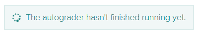
</div>

When the autograder finishes running, you can see a list of test cases you have passed or failed. All test cases have a short description of what is being tested; in addition, if you have failed a case, there will usually be some output that tells you (very briefly) why you failed. These test cases are more exhaustive than the ones in the starter code.

<div align="middle">
  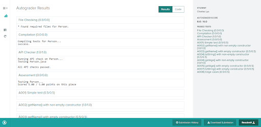
</div>

You can resubmit as many times as you want before the late submission deadline is passed, by using the “***Resubmit***” option at the bottom. However, if you wish to do so, ***you need to push your latest work to Git AND resubmit on Gradescope.*** Gradescope is not able to auto-sync with your Git repo. 

***You should resubmit the project (push to Git and resubmit on Gradescope) every time you make changes to the programming part of the assignment that you want to be graded. In particular, this also applies if you want to add Javadoc comments*** to your code for the Code Style requirements of the assignment (if applicable).

If you get a lower score on the resubmission and want to use an older submission instead, you can activate an old submission from “Submission History” at the bottom.

If you submit or resubmit after the grace period has passed (typically 24 hours after the official due date), a ***late penalty*** will apply. Refer to the syllabus for details on late penalties.

# Step 7: Complete the Analysis Part of the Assignment

Most assignments also come with a set of analysis questions, where you have to paste some results from running your program and/or answer some conceptual questions. 

You can typically get the analysis questions from the assignment writeup and on the Reflect form itself. Either answer directly on the Reflect form, or write your answers in a text editor and then paste them into the form.

The analysis questions will be manually graded by the UTAs, so your scores won’t appear immediately. Once the grades are published, typically soon after the assignment is due, you can check back on Gradescope to see the scores you got on the analysis. Note that before the assignment is due, you will still see an “Analysis” question on Gradescope without points; however, you don’t have to worry about it or do anything on Gradescope regarding the analysis.

# Tutorial Videos

## Cloning from GitLab

### Mac


### Windows


## Managing Project Workflow

### Mac


### Windows


