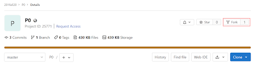
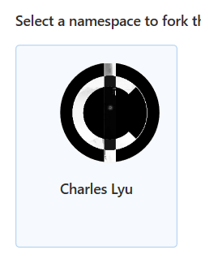
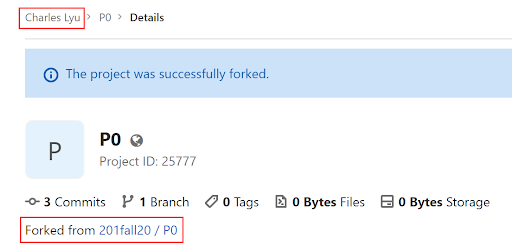

# Project Workflow
This guide will walk you through how to complete Java assignments/projects in Compsci 201 by using P0: Person201 as an example. Before starting, you should have installed all the necessary software (Java Liberica JDK, Git Bash, Visual Studio Code) as explained in this guide.

TODO DANIEL: ADD IN LINK ABOVE.

**NOTE**: If you wish, you may also follow these instructions in [video format](#video-links) under the videos "Mac_Cloning_Project/Windows_Cloning_Project" and "Mac_Project_Workflow"/"Windows_Project_Workflow."

TODO DANIEL: ADD IN PROPER VIDEO LINKS ONCE CREATED!

## Overview of Visual Studio Code

The official introduction to VS Code can be found [here](https://code.visualstudio.com/docs). In particular, the following links should be useful in getting to know VS Code!
- [User Interface](https://code.visualstudio.com/docs/getstarted/userinterface)
- [Settings](https://code.visualstudio.com/docs/getstarted/settings)
- [Introductory Videos](https://code.visualstudio.com/docs/getstarted/introvideos)

Upon installing VS Code, you'll be greeted with a launch screen like this:

<div align="middle">
  
</div>

For this course, you'll mainly be using "Open" to open folders that each store a collection of related Java files that you will code, run, and test.

## Step 0: Creating a Workspace for the Course

These instructions are copied over from the installation guide. For CS 201, you should set up a folder to store your code related to this course. It should be

in a location that you will remember
in a format/structure that makes sense to you

We recommend the following folder setup:

```
▼ CS 201
  ▼ APT
    ▼ APT 1
      - AccessLevel.java
      - CirclesCountry.java
    ▼ APT 2
      - TxMsg.java
      - ...
  ▼ Projects
    ▶ P0-Person201
    ▶ P1-NBody
    - ...
```

For this guide, we'll be focusing on the second subfolder, `Projects`.

## Step 1: Forking the Starter Code

For every Java project (sometimes called “assignment”), course staff will create a starter code repository on GitLab with namespace `201<semester><year>`, e.g. `201fall20`. The instructions document for the assignment will provide a link to the source code, which you should open.

Once you open that GitLab repository, **_you will need to fork the project first_**, that is, create your own copy of the repo. Click on the **“Fork”** button at the top right: (_If you don’t see the “Fork” button, sign in with your Duke NetID from the top right_).

<div align="middle">
  
</div>

Then choose your own account to fork it under your namespace (example: Charles Lyu (T'21)):

<div align="middle">
  
</div>

Once you fork the project, you should see your own name in the URL and on the project home page. It should also mention that your project is forked from the 201 namespace.

<div align="middle">
  
</div>

## Video Links

# APT Workflow (temporary until it's migrated to its own file)

## THIS DOCUMENT IS STILL UNDER EDITS

NOTE to people reading this, I'm largely referring to [this document](https://docs.google.com/document/d/1dlEwDwiIyEQFxXOHS_zY-Qojx4djl4p2Ud16qpeb7gY/edit#) AND this script (I would say we're currently at Step 2 of the document/ Clone SSH link on the following guide):

REVISED Project Workflow
Prior to Recording
- Make sure the folder you're storing stuff in matches the project structure in installingSoftware.md
- VSCode is a fresh copy without the Duke CS201 plugin installed
- Liberica is installed - any version > 11 will work
Cloning from GitLab
- Remind students that this video assumes you've set up an SSH key
- Show how to fork from GitLab page
- Clone SSH link
- Open up command line and navigate to the proper place
- Clone with command line and open folder in VS Code
- Show optional method: Open in your IDE -> Visual Studio Code (SSH)
- REMEMBER you have to make a new folder where you'll store in the repo files
Project Workflow
- Remind students that this video assumes that you have Liberica installed AND the previous instructions have been followed
- Show that VSCode is not recognizing Java
- Install Raj’s plugin
- Make one single change in the project (and make sure to save since it’s VSCode!!!!)
- Run through the trinity of Git commands
- Refresh the GitLab page and show that the change actually transferred over
- Show optional method: Use VSCode -> Source Control.
- Make another commit, stage commits, commit, and push (remember check mark is commit, all other commands are hidden elsewhere)

