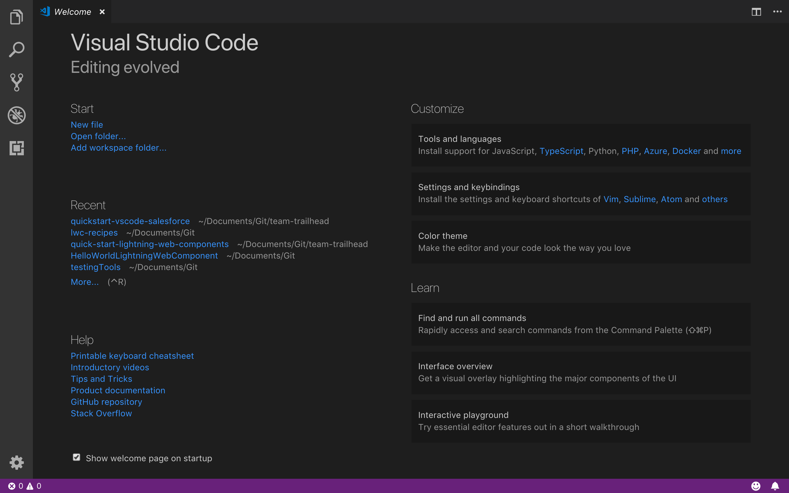
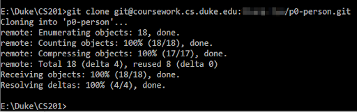
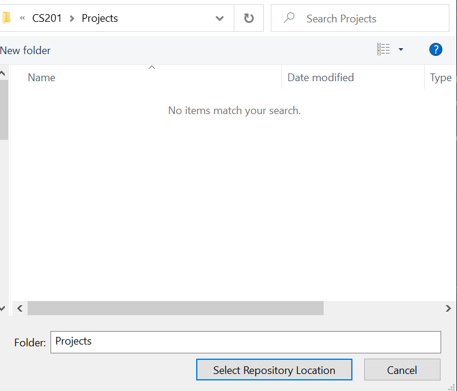

# Project Workflow
This guide will walk you through how to complete Java assignments/projects in Compsci 201 by using P0: Person201 as an example. Before starting, you should have installed all the necessary software (Java Liberica JDK, Git Bash, Visual Studio Code) as explained in this guide. You should have also installed a personal SSH key, as explained in the previous version of this guide.

TODO DANIEL: ADD IN LINK ABOVE.

**NOTE**: If you wish, you may also follow these instructions in video format under the videos "Mac_Cloning_Project/Windows_Cloning_Project" and "Mac_Project_Workflow"/"Windows_Project_Workflow."

TODO DANIEL: ADD IN PROPER VIDEO LINKS ONCE CREATED!

## Overview of Visual Studio Code

The official introduction to VS Code can be found [here](https://code.visualstudio.com/docs). In particular, the following links should be useful in getting to know VS Code!
- [User Interface](https://code.visualstudio.com/docs/getstarted/userinterface)
- [Settings](https://code.visualstudio.com/docs/getstarted/settings)
- [Introductory Videos](https://code.visualstudio.com/docs/getstarted/introvideos)

Upon installing VS Code, you'll be greeted with a launch screen like this:

<div align="middle">
  
</div>

For this course, you'll mainly be using "Open" to open folders that each store a collection of related Java files that you will code, run, and test.

## Step 0: Creating a Workspace for the Course

These instructions are copied over from the installation guide. For CS 201, you should set up a folder to store your code related to this course. It should be

in a location that you will remember
in a format/structure that makes sense to you

We recommend the following folder setup:

```
▼ CS 201
  ▼ APT
    ▼ APT 1
      - AccessLevel.java
      - CirclesCountry.java
    ▼ APT 2
      - TxMsg.java
      - ...
  ▼ Projects
    ▶ P0-Person201
    ▶ P1-NBody
    - ...
```

For this guide, we'll be focusing on the second subfolder, `Projects`.

## Step 1: Forking the Starter Code

For every Java project (sometimes called “assignment”), course staff will create a starter code repository on GitLab with namespace `201<semester><year>`, e.g. `201fall20`. The instructions document for the assignment will provide a link to the source code, which you should open.

Once you open that GitLab repository, **_you will need to fork the project first_**, that is, create your own copy of the repo. Click on the **“Fork”** button at the top right: (_If you don’t see the “Fork” button, sign in with your Duke NetID from the top right_).

<div align="middle">
  
</div>

Then choose your own account to fork it under your namespace (example: Charles Lyu (T'21)):

<div align="middle">
  
</div>

Once you fork the project, you should see your own name in the URL and on the project home page. It should also mention that your project is forked from the 201 namespace.

<div align="middle">
  
</div>

# Cloning the Repository to Your Computer

**_Now we need to clone your fork of the project using Git_**, that is, create a copy of the repo on your local machine.

Click on the **"Clone"** button, then copy the **_SSH URI link._** _DO NOT USE HTTPS!_

<div align="middle">
  
</div>

Now, open a _Terminal_ on Mac, or open either the _Command Prompt_ or _Git Bash_ shell on Windows (Command Prompt is more convenient as it allows Ctrl+V to paste). You will need to navigate to the place where you want to save the project, typically your CS201 workspace, using the cd command. Type

`cd "folder name"`

(use the actual folder name, and keep the quotation marks if it contains spaces) and press Enter. Keep doing this until you’ve reached the destination. On Mac you can type pwd to show the current directory and verify you’re at the correct place.

Once you’re in the directory of your choosing, type

`git clone your-project-URI`

where `your-project-URI` is the SSH URI you copied. Use Command-V/Ctrl-V to paste (or, in a Git Bash, right click and choose “Paste”).

Make sure the SSH URI is for the forked repo, i.e. has your own name in it! If it still has the 201 namespace, then fork the project [as described above](#step-1-forking-the-starter-code).

<div align="middle">
  
</div>

Git should have now created a new directory `“p0-person”`  within the current directory, with all files from the remote repo stored in it. Once you finish cloning, typing `ls` in Terminal/Git Bash or `dir` in Command Prompt should show the new directory with the project name. Alternatively, you can verify the existence of the project directory in the Finder or File Explorer.

If you encounter any errors or do not see the new directory, refer to the [Troubleshooting Document](https://docs.google.com/document/d/1Ce7HFLmEGsRMwGXGIxt5TpLHmjmjafHn1jNf7MRO8qw/edit).

TODO DANIEL: REPLACE WITH MARKDOWN

## Alternative Method: via VS Code

Alternatively, you can clone the repository directly through VS Code. Click the `Visual Studio Code (SSH)` button.

<div align="middle">
  
</div>

Accept all prompts. It will redirect you to Select a Repository Location, i.e, select the folder in which you will store the project. We recommend storing this folder in the same folder you've designated to store your projects.

<div align="middle">
  
</div>

Once you've done this, proceed to open your project.

# Step 3: Open the Project in VS Code

From VS Code, choose "Open Folder" from the welcome screen, and navigate to the project folder.

<div align="middle">
  
</div>

You should now have access to the contents of the folder!

# Step 4: Working on the Assignment

The assignment writeup document will tell you what you have to do. Most of the work will be completing existing Java classes given in the starter code, but sometimes you will also have to create your own classes/Java files. 

Many assignments come with executable classes, typically named as “Driver” or “Benchmark”, that you can run to test the correctness of your code or generate results for analysis questions. Refer to the “Running your code” section on how to execute them.

TODO DANIE: LINK TO RUNNING YOUR CODE


# APT Workflow (temporary until it's migrated to its own file)

## THIS DOCUMENT IS STILL UNDER EDITS

NOTE to people reading this, I'm largely referring to [this document](https://docs.google.com/document/d/1dlEwDwiIyEQFxXOHS_zY-Qojx4djl4p2Ud16qpeb7gY/edit#) AND this script (I would say we're currently at Step 3 of the document/ Clone SSH link on the following guide):

Cloning from GitLab
- Remind students that this video assumes you've set up an SSH key
- Show how to fork from GitLab page
- Clone SSH link
- Open up command line and navigate to the proper place
- Clone with command line and open folder in VS Code
- Show optional method: Open in your IDE -> Visual Studio Code (SSH)
- REMEMBER you have to make a new folder where you'll store in the repo files
Project Workflow
- Remind students that this video assumes that you have Liberica installed AND the previous instructions have been followed
- Show that VSCode is not recognizing Java
- Install Raj’s plugin
- Make one single change in the project (and make sure to save since it’s VSCode!!!!)
- Run through the trinity of Git commands
- Refresh the GitLab page and show that the change actually transferred over
- Show optional method: Use VSCode -> Source Control.
- Make another commit, stage commits, commit, and push (remember check mark is commit, all other commands are hidden elsewhere)

