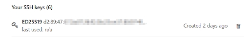
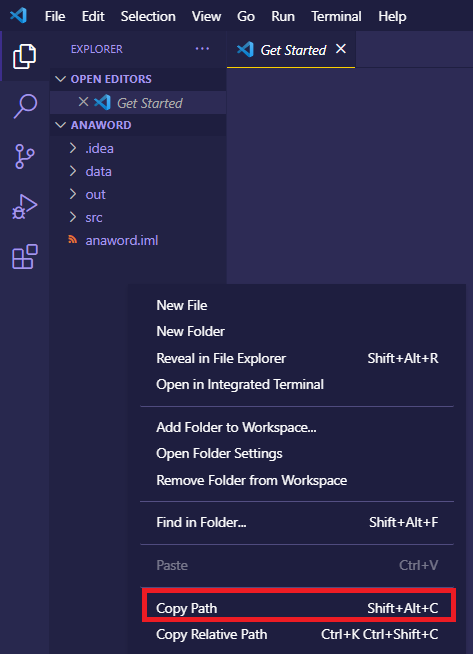

# Troubleshooting Guide

This guide was adapted from a Troubleshooting guide created by Charles Lyu (T'21). 

## VSCode + Java

TBD. Please post your question on Ed for further assistance. 

## Git - FAQ

These are some of the frequently asked questions we get with Git. We'll move around questions between the FAQ and Comprehensive question as we get feedback.

<details>
<summary>When trying to install Git, I am having difficulties with Homebrew</summary>
<br>

- If the student has already successfully installed Homebrew, have them run the command `brew install git` (no $). If that fails, have them reinstall Homebrew and then repeat the process.

- If they are having difficulty installing Homebrew, a general rule of thumb is to make sure that the student's OS is up to date. If the student is not on the most recently available OS, have them update in order to increase chances of success. Afterwards, run the commands supplied on the Homebrew page again.

- If the student is having any difficulty with their `bin` folder not existing or any other fatal directory issues, refer the student to OIT; their machine needs serious maintenance and restructuring.

</details>

<details>
<summary>When I try to do anything Git related, my computer asks me for a password</summary>
<br>

- If the student has been able to use Git successfully in the past, then they **cloned with HTTPS instead of SSH**. To resolve this issue, have them save the code they have written so far locally (*not in IdeaProjects*), repull the project via SSH, and then replace the files in their new starter code with their locally stored code.

- If the student has never used Git successfully, then they need to **reconfigure their SSH key**. When doing so, walk through them through the steps detailed in the key configuration guide [here](https://coursework.cs.duke.edu/cs201projects/resources-201/-/blob/main/installingSoftware.md) and lend attention to two important details:

    1. The student must set save the key to a default location (press "Enter" once) and then set a default password (press "Enter" twice)

    2. When linking the key to GitLab, the student must access their account at `coursework.cs.duke.edu` and login via Shibboleth. They should *not* login in at `gitlab.oit.duke.edu` with a username and password.

- If the student is still unable to configure their SSH key after following the above steps, then they likely *have another primary SSH key for personal/professional use*. To work around this, run the following set of UNIX commands and then reattempt linking the SSH key to GitLab:

```bash
eval $(ssh-agent -s)
ssh-add ~/.ssh/id_ed25519
```

</details>


<details>
<summary>When I try pushing anything to Git, the process fails or some error message appears</summary>
<br>

- First, check whether the student **has been successful in the past with Git**. If they have not, run a quick diagnostic to see if they have configured their SSH key properly by running `ssh -T git@coursework.cs.duke.edu`.

- Next, ask the student if they forked the repository, and if they are not sure, go to the GitLab page and check if they did so. If the student did not fork the repository, have them save their code in a secure place, delete the repository from IdeaProjects, fork the repository, and then repull it. 

- Otherwise, make sure that the student is in the proper directory by having them run the command `pwd` in their terminal. If they are not, make sure that they follow the proper file path and eventually `cd IdeaProjects` and then `cd project_name`.

- From here, make sure that the student writes the following three UNIX commands while in the proper directory:

```bash
git add .
git commit -m "write comment here"
git push
```

- Now suppose the student follows all of those steps, yet they receive the following error message

```bash
/Users/student/.config/git/ignore: Permission denied
Users/student/.config/git/attributes: Permission denied
```

This means that the student has certain permission errors on their machine. To resolve this issue, have the student return to their home directory by running `cd ~`,
 run `sudo chmod 755 .config`, and then type in their password for their device.

</details>

<details>
<summary>My partner and I are working on the same repository, and we're having trouble pushing code</summary>
<br>

- The code is being rejected because their local commits (changes) are not in sync with the remote history. This happens if both people are working on the same repo on different computers, or if several people are collaborating on the same repository. If computer A pushes changes to GitLab, and computer B also pushes, GitLab could not tell whether it should accept A's or B's changes, so the push will be rejected.

- To resolve this, they will need to `git pull` from remote. To do so, they should run the following set of commands:

```bash
git pull
//potentially resolve merge conflict manually
git push
```

- In the event that Git is not able to automatically resolve the issue, the student will have to resolve the issue manually. Running the three `git add .`, `git commit -m "comment"`, and `git push` commands should resolve the issue.

- If you would like to learn more about Git merge conflicts, feel free to watch the video [here](https://duke.zoom.us/rec/play/SaYwuDmE_e1ktnTdXyZFlUB4Je0jAp90JJsYpv6nGO_6xgn2eTFqcR9poqNQpKOqlswpyR54w5lkpw.jhA1Dob-5DIFNjdB?continueMode=true&_x_zm_rtaid=WRHafTqZSU-Bw07DppwXJg.1614437909258.5f6f5e1afb9e427d7e1e52e2574318f9&_x_zm_rhtaid=958) for your own edification. 

</details>

## Git - Comprehensive

<details>
<summary>I get the error “Permission denied (publickey)” when cloning the repo from GitLab with an SSH URI:</summary>

```
Permission denied (publickey).
fatal: Could not read from remote repository.
Please make sure you have the correct access rights
and the repository exists.
```

Special thanks to former CS201 Head UTA, Morton Mo, for this section of the guide.

You have either not created an SSH Key on your computer, or have not pasted it in to your GitLab profile correctly. Refer to the installation guide on how to set up SSH Keys. **Make sure you upload the public key to https://coursework.cs.duke.edu, not https://gitlab.cs.duke.edu.**

If you have already done so but still get the error, verify the fingerprints of your SSH keys match locally and remotely. Run the following commands in your computer's Terminal (or Git Bash on Windows):

```
ssh-keygen -E md5 -lf ~/.ssh/id_ed25519.pub
ssh-keygen -E md5 -lf ~/.ssh/id_ed25519
```

Both outputs should match.
Then, on the “Settings” -> “SSH Keys” page on GitLab, verify the fingerprint matches with the output of commands above:

<div align="middle">
  
</div>

If the fingerprint does not match, you’re using the wrong key. Try uploading the correct public key to GitLab or generate a new one.

Prior to generating a new key, make sure any other SSH keys are deleted. Navigate to your This PC (Windows) or /Users/yourUsername (Mac) folder, navigate to the .ssh folder, and delete all contents inside, which will allow you to start over from scratch.
</details>

<details>
<summary>I get the following error when doing git add .: “fatal: Not a git repository (or any of the parent directories)”.</summary>
<br>

The error message means the current directory your Terminal/Bash/CMD is in is not a Git repository. _**Make sure you’re working in the correct directory: it should be the root of your project folder for this specific assignment**_, which is typically named after the project name. 

In particular, make sure you’re NOT in the src folder, and NOT in a generic workspace for the course (e.g. “CS201”).

In a Mac Terminal or Git Bash on Windows, you can type `pwd` to show the current path. 

If you cloned the project repository correctly, you should see `(main)` appear after your project path, indicating you are in a Git repository. If this is not the case AND you are sure you are in the right repository, it means your project directory was not initialized as a Git repository, probably because you didn’t create it properly or accidentally deleted some files. See the next bullet point (I accidentially downloaded the code as a ZIP file...) for advice.
</details>

<details>
<summary>I accidentally downloaded the code as a ZIP file. How can I set up the Git repo so that I can push my work to Git?</summary>
<br>

First, make sure you have actually forked the repo (so that it’s under your own namespace and not the 201fall20 namespace or some other variant). Refer to the project workflow for instructions.

Open a Terminal or CMD and navigate to your directory. Make sure you’re in the root folder of your project: it should contain a src subdirectory which has all the Java files.

Then use the following commands:

```
git init
git remote add origin <your-project-URI>
git add .
git commit -m "Initial commit"
git push -f -u origin master
```

Replacing `<your-project-URI>` with the SSH URI of your project, which can be copied from the GitLab project home page (see Step 2 of the Project Workflow guide). Make sure the SSH URI looks like:

`git@coursework.cs.duke.edu:firstname.lastname/projectname.git`

(Make sure it has your own namespace and not 201fall20 or some other variant!)

These commands will initialize the directory as a Git repository and link it to the remote repo.

Careful: Don’t leave out the “-f -u” in git push! This means the git push command here is forced, which means it will override any changes you made in the remote repository on GitLab. If you’ve made changes there (via another computer probably) and you want to keep them, manually put the changes into the files on your local computer first.

**FINALLY: If all of the above does not work, then copy your modified files into a separate folder and start over with cloning your fork/local copy of the project, then copy and paste in your code.**

</details>

<details>
<summary>I get the following error when doing git push: “You are not allowed to push code to this project”.</summary>
<br>

```
> GitLab: You are not allowed to push code to this project.
fatal: Could not read from remote repository.

Please make sure you have the correct access rights
and the repository exists.
```

You do not have permission to push to this remote repo. It’s probably because you cloned the repo from the 201 namespace (e.g. 201fall20), instead of your personal, forked repo.

- First, make sure you have actually forked the repo. Refer to this document for instructions.
  - Copy the SSH URI from the “Clone” button to the right of your GitLab project home page (refer to Step 2 here). 
  - It should look like `git@coursework.cs.duke.edu:firstname.lastname/projectname.git` (Make sure it has your own namespace and not 201fall20!)

In a Terminal or CMD, navigate to your local project folder, and use the following command to change the remote repository to use the SSH URI:

`git remote set-url origin <SSH-URI>`

Replace `<SSH-URI>` with the actual SSH URI of your GitLab project that you just copied.
You can then use

`git remote get-url origin`

To verify the URI is correct. If yes, try pushing again.

</details>

<details>
<summary>When I try to push to Git, I get a “Git Credentials” dialog asking for my username and password. Then I get an “HTTP Basic: Access denied” error:</summary>
<br>

```
remote: HTTP Basic: Access denied
fatal: Authentication failed for 'YOUR-URI'
```

You are using the HTTP protocol instead of the SSH protocol, i.e. you cloned the repo using the HTTPS URI. 

Copy the SSH URI from the “Clone” button to the right of your GitLab project home page (refer to Step 2 here). It should look like 
`git@coursework.cs.duke.edu:firstname.lastname/projectname.git`
(Make sure it has your own namespace and not 201fall20 or some other variant!)

Then, in a Terminal or CMD, navigate to your project directory and use the following command to change the remote repository to use the SSH URI:

`git remote set-url origin <SSH-URI>`
 
Replace `<SSH-URI>` with the actual SSH URI of your GitLab project.
You can then use

`git remote get-url origin`

To verify the URI is correct.

</details>

<details>
<summary>I get the error “Updates were rejected because the remote contains work that you do not have locally” when using git push:</summary>
<br>

```
! [rejected]        master -> master (fetch first)
error: failed to push some refs to 'YOUR-URI'
hint: Updates were rejected because the remote contains work that you do
hint: not have locally. This is usually caused by another repository pushing
hint: to the same ref. You may want to first integrate the remote changes
hint: (e.g., 'git pull ...') before pushing again.
hint: See the 'Note about fast-forwards' in 'git push --help' for details.
```

You code is being rejected because your local commits (changes) are not in sync with the remote history. This could happen if you are working on the same repo on different computers, or if several people are collaborating on the same repo (for group assignments). If computer A pushes changes to GitLab, and computer B also pushes, GitLab could not tell whether it should accept A's or B's changes, so push will be rejected. To fix this, simply git pull from remote before pushing to it:

```
git pull
# resolve merge conflicts as needed
# fill in merge message
git push
```

When you do this, Git will load the remote changes that your local repo does not have. It will try to automatically resolve any conflicts, but occasionally you need to resolve them manually. If you’re prompted to do that after git pull, open the files in IntelliJ and make the necessary changes, then use git add . and git commit -m "..." commands to make a new commit before git push.

[Here](https://duke.zoom.us/rec/share/55RoH5Xf1E9JYK_k4kDyZ6wwMJ65T6a8hyBPq6cOxRvt74iM19Y1ayW22FUeoW7t) is a video of CS201 Spring ‘20 Head UTAs explaining how to use Git in groups. The last part of the video mentions how to resolve merge conflicts like this.

</details>

<details>
<summary>I get the message “nothing to commit, working tree clean” and “Everything up-to-date” when I try to commit and push.</summary>
<br>
You have not made any changes in your current repo. Check that you have saved all files.

If you’re certain you made some changes but this error still occurs, you may have cloned multiple copies of the same repo on your computer. Make sure you’re working on the correct one.

You can use `pwd` in Terminal or Git Bash to show the current path of the repo you’re trying to push. You can also see the path of your VS Code project by right clicking on the File Explorer and clicking "Copy Path." Verify the two paths are the same.

<div align="middle">
  
</div>

</details>

<details>
<summary>There is a weird window popping up when I am committing / merging. What is it and what do I do with it?</summary>
<br>
This is a command-line editor. This usually happens when you forget to specify the -m flag when committing, so Git did not get your commit message. 
Depending on your configurations, it could either be a nano editor (default for Mac), a vi editor (default for some Linux distributions), or an emacs editor. To save the message and exit, follow these steps:

- Your Terminal window should tell you what editor you are currently using. Depending on this, move to different steps
- If vi(m) is shown, follow this tutorial: https://www.cyberciti.biz/faq/linux-unix-exit-vim-editor/ 
- If nano is shown, follow this tutorial: https://wiki.gentoo.org/wiki/Nano/Basics_Guide
- If emacs is shown, follow this tutorial: https://ftp.gnu.org/old-gnu/Manuals/emacs/html_node/emacs_18.html
</details>


<details>
<summary>I get the error “pathspec ‘...’ does not match any file(s) known to git” when using git commit:</summary>
<br>

```
> git commit -m “my commit message”
error: pathspec 'commit' does not match any file(s) known to git
error: pathspec 'message' does not match any file(s) known to git
```

- Make sure you included the -m in the git commit command.
- Make sure you put the commit message in either single or double quotes.
- Make sure the quotation marks are regular ones (""), not “smart” ones (“”). This issue can occur if you copied the commands from Google Docs or other text editors. To fix this, delete the quotation marks from Terminal/Command Prompt and then type them again manually.

</details>


TODO DANIEL: installation guide + project workflow guide link everywhere


